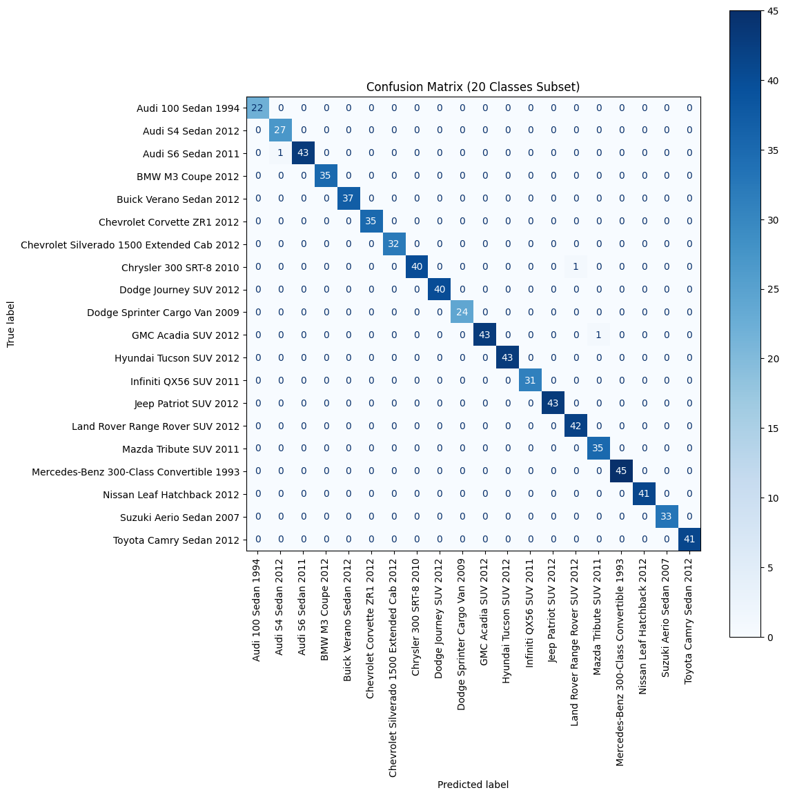
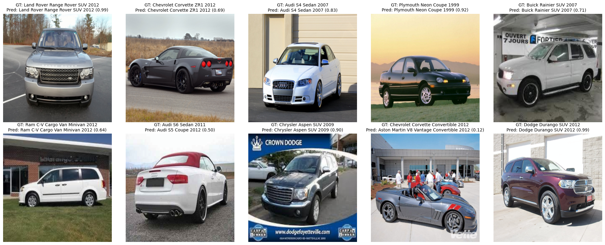

# Car Model Detection
This project focuses on detecting and classifying car models using the [Stanford Car Dataset](https://www.kaggle.com/datasets/jutrera/stanford-car-dataset-images-in-224x224). The implementation is done in a Jupyter Notebook using transfer learning with ResNet18 to perform fine-grained classification of car images.


## Project Structure

car-model-detection/
├── car-model-detection.ipynb # Main notebook with the complete pipeline
└── README.md 


## Features

- Image preprocessing and data augmentation
- Transfer learning using ResNet18
- Training and validation on a labeled dataset of car models
- Visualization of accuracy and loss during training
- Evaluation on test images using confusion matrix and classification report


## Requirements

Install the following Python libraries:

```bash
pip install numpy pandas matplotlib seaborn opencv-python scikit-learn torch torchvision
```

## Results

- Training accuracy: ~98.74%

- Validation accuracy: ~88.36%%

Confusion matrix for the first 20 classes:



Sample predictions on unseen test images:




## Contributions
Contributions are welcome! Please feel free to open issues or pull requests.

Contact: arashkeshavarzx@gmail.com


